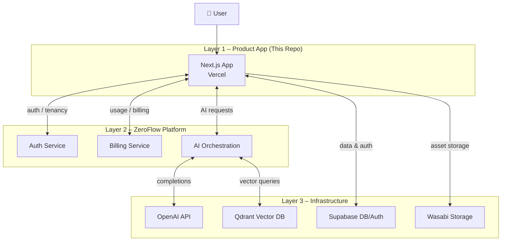

# ZeroLabs AI Publisher

> AI-powered automated publishing platform for websites, portfolios, and social media — part of the **ZeroFlow** ecosystem.

[](https://nextjs.org)
[](https://vercel.com)
[](https://supabase.com)
[](https://openai.com)

---

## Quick Start

```bash
git clone https://github.com/zerolabsdotaipublisher-ai/zerolabs-ai-publisher.git
cd zerolabs-ai-publisher
npm install
cp .env.example .env.local   # fill in your credentials
npm run dev                  # → http://localhost:3000
```

> See [Environment Setup](#environment-setup) for a full list of required variables.

---

## Table of Contents

- [Project Overview](#project-overview)
- [Architecture](#architecture)
- [Architecture Diagram](#architecture-diagram)
- [Scope](#scope)
- [Tech Stack](#tech-stack)
- [Next.js Framework Conventions](#nextjs-framework-conventions)
- [Getting Started](#getting-started)
- [Environment Setup](#environment-setup)
- [Running Locally](#running-locally)
- [Build and Production](#build-and-production)
- [Deployment](#deployment)
- [Observability](#observability)
- [Project Structure](#project-structure)
- [Security Notes](#security-notes)
- [Contributing](#contributing)

---

## Project Overview

**ZeroLabs AI Publisher** is a production-grade Next.js application (App Router) that enables users to plan, generate, and publish AI-assisted content across websites, portfolios, and social media channels.

It is the **Layer 1 Product Application** within the broader [ZeroFlow](#architecture) ecosystem, consuming platform services (auth, billing, AI orchestration) from Layer 2 and infrastructure providers from Layer 3.

Key capabilities include:

- AI-powered content generation via OpenAI
- Timezone-aware AI content scheduling with recurring publish/update support
- Semantic search and recommendations powered by Qdrant vector database
- Asset storage backed by Wasabi (S3-compatible object storage)
- User authentication and data persistence via Supabase
- Multi-tenant support through the ZeroFlow platform

---

## Architecture

This project is part of the ZeroFlow ecosystem:

### Layer 1 — Product Application (This Repo)

- Next.js frontend + API routes, hosted on Vercel
- Supabase Postgres database for application data
- App-specific business logic, UI, and content workflows

### Layer 2 — ZeroFlow Platform

Provides shared platform services consumed by this app:

- Authentication & tenant management
- Usage tracking & billing
- AI orchestration layer

### Layer 3 — Infrastructure Providers

| Provider   | Role                        |
|------------|-----------------------------|
| **OpenAI** | AI content generation       |
| **Qdrant** | Vector database for search  |
| **Wasabi** | Object storage (S3-compatible) |
| **Supabase** | Database & authentication  |

```
┌─────────────────────────────────────┐
│  Layer 1 — ZeroLabs AI Publisher    │
│  (Next.js · Vercel)                 │
└──────────────┬──────────────────────┘
               │
┌──────────────▼──────────────────────┐
│  Layer 2 — ZeroFlow Platform        │
│  (Auth · Billing · Orchestration)   │
└──────────────┬──────────────────────┘
               │
┌──────────────▼──────────────────────┐
│  Layer 3 — Infrastructure Providers │
│  OpenAI · Qdrant · Wasabi · Supabase│
└─────────────────────────────────────┘
```

---

## Architecture Diagram

The diagram below shows the full request flow from user to infrastructure across all three layers of the ZeroFlow ecosystem.



---

## Scope

**This repository contains:**

- The product application (Layer 1): Next.js frontend, API routes, feature modules, and Supabase database schema

**This repository does NOT include:**

- ZeroFlow platform services (Layer 2) — auth service, billing service, and AI orchestration layer are external platform dependencies
- Infrastructure provisioning (Layer 3) — OpenAI, Qdrant, Wasabi, and Supabase are consumed as hosted services; their infrastructure is managed outside this repo

> This boundary prevents confusion when onboarding new contributors and makes the integration points explicit.

---

## Tech Stack

| Technology | Purpose |
|---|---|
| **Next.js 16** (App Router) | Full-stack React framework |
| **TypeScript** | Type-safe development |
| **Supabase** | PostgreSQL database & authentication |
| **OpenAI API** | AI content generation |
| **Qdrant** | Vector database for semantic search |
| **Wasabi** | S3-compatible object storage |
| **Vercel** | Hosting & deployment |

---

## Next.js Framework Conventions

The framework baseline in this repository was established previously and is validated in-place (not recreated).

- **Framework/runtime:** Next.js 16 with React 19 (`package.json`)
- **Router:** App Router via `app/` (`app/layout.tsx`, `app/page.tsx`)
- **TypeScript:** Enabled with strict mode (`tsconfig.json`)
- **Styling baseline:** Global styles in `app/globals.css` and route-scoped styles with CSS Modules (for example `app/page.module.css`)
- **Linting:** Next.js Core Web Vitals + TypeScript config via `eslint.config.mjs`
- **Static assets:** `public/` with placeholder directories for future brand/icon/image assets

For framework-specific guidance, see:
- [docs/setup/nextjs-framework.md](docs/setup/nextjs-framework.md)
- [docs/setup/environment.md](docs/setup/environment.md)
- [docs/setup/configuration.md](docs/setup/configuration.md)

---

## Getting Started

### Prerequisites

- Node.js 20+
- npm 10+
- A Supabase project
- An OpenAI API key
- A Qdrant instance (cloud or self-hosted)

### Clone the Repository

```bash
git clone https://github.com/zerolabsdotaipublisher-ai/zerolabs-ai-publisher.git
cd zerolabs-ai-publisher
```

### Install Dependencies

```bash
npm install
```

---

## Environment Setup

> ⚠️ **Never commit real secrets.** Only `.env.local` should hold live credentials — it is listed in `.gitignore` and must never be pushed to version control.

Copy the example environment file and fill in your values:

```bash
cp .env.example .env.local
```

Environment variables are loaded from `.env.local` by Next.js. Required variables are validated at startup — the app will throw a clear error listing any missing values.

**Required for every environment:**

| Variable | Description |
|---|---|
| `NEXT_PUBLIC_APP_NAME` | Application display name |
| `NEXT_PUBLIC_APP_URL` | Canonical URL for this deployment |
| `NEXT_PUBLIC_SUPABASE_URL` | Supabase project URL (browser-safe) |
| `NEXT_PUBLIC_SUPABASE_ANON_KEY` | Supabase anonymous key (browser-safe) |
| `SUPABASE_SERVICE_ROLE_KEY` | Supabase service role key (server-side only) |
| `OPENAI_API_KEY` | OpenAI API key (server-side only) |

> Keep server-only values (`SUPABASE_SERVICE_ROLE_KEY`, `OPENAI_API_KEY`) out of client components and never prefix them with `NEXT_PUBLIC_`.

For the complete variable reference — including optional, future, and Vercel-provided variables, the full environment matrix, and key-rotation procedures — see **[docs/environment-variables.md](docs/environment-variables.md)**.

For local setup steps see [docs/setup/environment.md](docs/setup/environment.md).

---

## Running Locally

```bash
npm run dev
```

The application will be available at [http://localhost:3000](http://localhost:3000).

---

## Build and Production

```bash
# Create a production build
npm run build

# Start the production server
npm start
```

Run the linter before building:

```bash
npm run lint
```

---

## Deployment

This application is designed to be deployed on **[Vercel](https://vercel.com)**.

### Quick setup

1. Connect the `zerolabsdotaipublisher-ai/zerolabs-ai-publisher` repository to a Vercel project.
2. Set the **Framework Preset** to **Next.js** and leave the **Root Directory** blank.
3. Set the **Production Branch** to `main`.
4. Add all required environment variables under **Settings → Environment Variables** (see `.env.example` for the full list).
5. Vercel will automatically build and deploy on every push to `main` (production) and to all other branches (preview).

### Branch → deployment mapping

| Branch | Deployment type |
|---|---|
| `main` | Production |
| `develop`, `feature/*`, pull requests | Preview |

### Deployment pipeline reference

> For the complete deployment pipeline guide — including build settings validation, environment variable scoping, preview vs production behavior, rollback/redeploy procedures, and a 404 diagnostic checklist — see:
>
> **[docs/deployment/vercel-pipeline.md](docs/deployment/vercel-pipeline.md)**

---

## Observability

Zero Labs AI Publisher uses a centralized, structured JSON logging system
compatible with Vercel's runtime log stream and any log drain.

- All logs are emitted as structured JSON via the centralized `lib/observability/logger.ts`.
- Request logging, error normalization, metrics counters, and external service wrappers are all provided under `lib/observability/`.
- A health check endpoint is available at **`GET /api/health`**.
- Startup events are logged via `instrumentation.ts`.

For the full strategy — log levels, event categories, required fields,
redaction rules, Vercel log inspection, and alert-readiness conditions — see:

> **[docs/observability/logging-monitoring.md](docs/observability/logging-monitoring.md)**

---

## Project Structure

```
zerolabs-ai-publisher/
├── app/                  # Next.js App Router — pages, layouts, and API routes
│   └── api/              # Server-side API route handlers (auth, projects, publishing, webhooks)
├── components/           # Reusable React components
│   ├── dashboard/        # Dashboard-specific components
│   ├── forms/            # Form components
│   ├── marketing/        # Marketing/landing page components
│   ├── shared/           # Shared layout components
│   └── ui/               # Base UI primitives
├── config/               # Application configuration
│   ├── index.ts          # Single entry point — import from "@/config"
│   ├── app.ts            # App metadata and typed AppConfig
│   ├── env.ts            # Typed, validated environment variables
│   ├── features.ts       # Feature flag definitions
│   ├── routes.ts         # Route constants
│   └── services.ts       # Grouped external service configs
├── features/             # Feature-based modules (auth, projects, publishing, assets, analytics)
├── hooks/                # Custom React hooks
├── lib/                  # Core library code
│   ├── ai/               # AI utilities and helpers
│   ├── api/              # API client helpers
│   ├── auth/             # Authentication utilities
│   ├── billing/          # Billing integration
│   ├── db/               # Database access layer
│   ├── storage/          # Storage utilities
│   ├── types/            # Shared TypeScript types
│   └── utils/            # General utilities
├── services/             # External service integrations
│   ├── openai/           # OpenAI API client
│   ├── qdrant/           # Qdrant vector DB client
│   ├── supabase/         # Supabase client
│   ├── wasabi/           # Wasabi storage client
│   └── zeroflow/         # ZeroFlow platform client
├── supabase/             # Supabase migrations and configuration
├── public/               # Static assets
├── tests/                # Test suite
├── .env.example          # Example environment variables template
└── next.config.ts        # Next.js configuration
```

---

## Security Notes

- **Never commit `.env` or `.env.local`** to version control — they are listed in `.gitignore`.
- Use `.env.example` as the canonical reference for required variables. It contains only placeholder values and is safe to commit.
- The `SUPABASE_SERVICE_ROLE_KEY` and `OPENAI_API_KEY` are server-side secrets — never expose them in client-side code or prefix them with `NEXT_PUBLIC_`.
- `JWT_SECRET` should be a long, cryptographically random string. Rotate it if it is ever compromised.
- Review Vercel's [environment variable documentation](https://vercel.com/docs/projects/environment-variables) to ensure secrets are scoped correctly (Production / Preview / Development).

---

## Contributing

### Branching Strategy

This project uses a `main` / `develop` / `feature/*` branching model:

| Branch | Purpose |
|---|---|
| `main` | Production-ready code — protected, deploys to production |
| `develop` | Integration branch for upcoming work — protected |
| `feature/<description>` | Short-lived branch for a single task or fix |

All changes go through pull requests. Direct pushes to `main` and `develop` are not allowed.

> See [docs/branching-strategy.md](docs/branching-strategy.md) for the full workflow, branch protection settings, and naming conventions.

### Commit Messages

Please use [Conventional Commits](https://www.conventionalcommits.org/) format (e.g. `feat: add publishing scheduler`).

---

## License

Private — All rights reserved. © ZeroLabs AI
