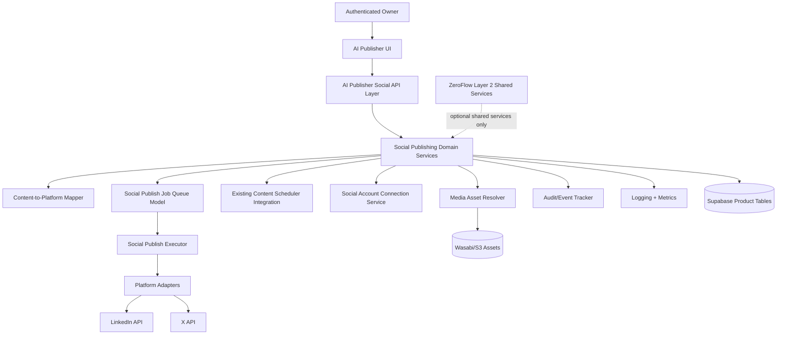

# Social Media Publishing Architecture (ZLAP-STORY 7-1)

## 1) Scope and requirements

This story defines architecture only for social media publishing inside Layer 1 AI Publisher.

- In scope: domain model, workflows, queueing model, scheduling integration, security model, persistence design, observability, MVP boundaries, and implementation guidance.
- Out of scope: OAuth implementation, migrations, API route implementation, runtime platform publishing, UI implementation.

Architecture boundary:

- AI Publisher (Layer 1) owns social publishing domain logic, account metadata, payload mapping, publish job lifecycle, and publish meaning.
- ZeroFlow (Layer 2) may later provide shared auth, billing, ledger, storage abstraction, audit sink, and shared monitoring, but does not own social publishing semantics.

## 2) MVP scope and platform recommendation

Recommended initial platform support for MVP:

1. LinkedIn (member + organization posting)
2. X/Twitter (text + single image first)

MVP constraints:

- Text-first publishing with optional image attachment.
- Single-post publish and scheduled publish.
- One account per platform per workspace for MVP.
- No threaded posts, no multi-image carousel, no video-first publishing in MVP.
- Reuse existing schedule execution path and publish observability conventions.

## 3) High-level architecture

## 4) Domain model

Core entities (product-owned):

- `SocialAccountConnection`: workspace-owned platform account link and status.
- `SocialAccountCredential`: encrypted token reference + token lifecycle metadata.
- `SocialPublishTarget`: platform + account + channel scope.
- `SocialPublishContent`: canonical social post payload (text, links, media refs, hashtags, locale).
- `SocialPublishMapping`: canonical-to-platform transformed payload and validation output.
- `SocialPublishJob`: execution unit for immediate/scheduled publishing.
- `SocialPublishAttempt`: per-attempt execution history and provider response metadata.
- `SocialPublishEvent`: immutable audit/event entries.

State models:

- Connection: `disconnected | connecting | connected | token_expiring | reconnect_required | revoked`
- Job: `draft | queued | scheduled | running | published | partial_failed | failed | cancelled`
- Attempt: `queued | running | succeeded | failed | retry_scheduled | exhausted`

## 5) Account connection and OAuth/token architecture

- OAuth initiation and callback are handled in AI Publisher routes/services (future stories).
- Tokens never stored in plaintext; store encrypted token payload or reference + rotation metadata.
- Persist `expires_at`, `scopes_granted`, `last_refresh_at`, `refresh_failures`, `revoked_at`.
- Background token refresh can be integrated into existing scheduler/worker trigger patterns.
- Re-auth required when scope mismatch, hard revocation, or refresh exhaustion occurs.

## 6) Content-to-platform mapping architecture

Canonical model first, platform adapters second:

1. Build canonical social payload from generated content (EPIC 6 blog/article/website artifacts).
2. Apply policy checks (length, media count/type, restricted fields).
3. Map canonical payload to platform-specific request payload via adapter contract.
4. Validate mapped payload before queue enqueue.

Adapter contract (design only):

- `validate(payload, accountCapabilities) -> validationResult`
- `map(canonicalPayload) -> platformPayload`
- `publish(platformPayload, credentials) -> providerResult`
- `normalizeError(providerError) -> classifiedError`

## 7) Pipeline, queue, scheduling, lifecycle, retry

Pipeline stages:

1. Draft/select content
2. Target selection
3. Mapping + validation
4. Queue job creation
5. Worker claim/lock
6. Provider publish call
7. Persist outcome + event/audit logs
8. Update content/publish linkage

Scheduling model:

- Reuse existing scheduling concepts (`content_schedules`, `content_schedule_runs`) by adding social target semantics in future stories.
- Do not introduce a second disconnected scheduler.
- Scheduled jobs should produce run logs compatible with current scheduling observability.

Queue and concurrency:

- One active lock per `(workspace_id, platform, account_id)` to avoid duplicate concurrent publishes.
- Idempotency key per job (`job_id + target + canonical_content_hash`).
- Duplicate request handling mirrors existing publish queue patterns.

Retry/recovery:

- Exponential backoff with jitter for retryable failures.
- Classify non-retryable: auth revoked, permission denied, validation violation, unsupported media.
- Retry exhaustion transitions to `failed/exhausted` and requires operator action.

Rate limit/throttle:

- Per-platform token bucket budget.
- Per-account cooldown windows.
- Provider response headers update local budget state.
- Queue prioritizes oldest due jobs but respects platform/account quotas.

## 8) Media handling architecture

- Social media uses existing product-owned media references; no separate media subsystem.
- Preflight checks: file type, size, aspect ratio (where known), and accessibility metadata.
- Media upload strategy:
  - Prefer provider-direct upload when required by API.
  - Cache upload handles for reuse within same publish attempt where supported.
- Store media processing outcomes in attempt metadata.

## 9) Security, access control, audit, monitoring

Security and secrets:

- Secrets in server-only config; no client exposure.
- Encrypted credential storage and strict redaction in logs.
- Request signing/CSRF protections for OAuth callbacks (future implementation story).

Access control:

- Owner-scoped and workspace-scoped permissions, aligned with existing publish permission model.
- Social accounts and jobs are tenant-isolated by user/workspace ownership keys.

Audit/event tracking:

- Immutable events for connect/disconnect, token refresh, job queued, publish succeeded/failed, retry exhausted, manual replay.
- Extend existing observability event conventions with social event names.

Monitoring/alerting:

- Reuse `lib/observability` logger + metrics patterns.
- Key alerts: spike in auth failures, retry exhaustion rate, persistent rate-limit blocking, queue lag SLA breach.

## 10) Persistence architecture (design target)

Planned product-owned tables (future migration stories):

- `social_account_connections`
- `social_account_credentials`
- `social_publish_jobs`
- `social_publish_attempts`
- `social_publish_events`
- optional `social_rate_limit_budgets`

Storage principles:

- All rows include ownership fields (`user_id`, `workspace_id` when available), timestamps, versioning metadata.
- Soft-delete and revocation timestamps for connection lifecycle safety.
- Index by `(user_id, platform, status, scheduled_for, created_at)` for queue/schedule retrieval.

## 11) Integration boundaries with EPIC 5/6 systems

- EPIC 6 generated artifacts (blog/article/SEO/content) are source inputs for social payload generation.
- EPIC 5/publish lifecycle remains website publishing authority; social publishing references content versions but does not fork a second content model.
- Existing scheduling and publish observability conventions are reused.
- No social publishing domain ownership in `services/zeroflow`.

## 12) Extensibility strategy

- Add new platforms by implementing adapter contract only.
- Keep canonical payload stable; adapter capability matrix handles divergence.
- Feature expansion roadmap: threads, carousel/video, approvals, team roles, analytics attribution, cross-platform campaigns.

## 13) MVP and delivery constraints review

MVP is considered valid when:

- Architecture remains Layer 1 product-owned.
- No new disconnected scheduling/publishing subsystem is introduced.
- Security model avoids plaintext token handling.
- Queue/retry/rate-limit model is operationally realistic.
- Platform support is intentionally constrained.

## 14) Task-to-file mapping (all 23 tasks)

1. Scope/requirements -> `docs/social/social-media-publishing-architecture.md`
2. Use cases/flows -> `docs/social/social-media-publishing-flows.md`
3. Platform support/constraints -> `docs/social/social-media-publishing-architecture.md`, `docs/social/social-media-publishing-mvp-plan.md`
4. Domain model -> `docs/social/social-media-publishing-architecture.md`
5. Account connection architecture -> `docs/social/social-media-publishing-architecture.md`, `docs/social/social-media-publishing-flows.md`
6. Content mapping architecture -> `docs/social/social-media-publishing-architecture.md`, `docs/social/social-media-publishing-flows.md`
7. Publishing pipeline architecture -> `docs/social/social-media-publishing-architecture.md`, `docs/social/social-media-publishing-flows.md`
8. Scheduling/delayed publishing -> `docs/social/social-media-publishing-architecture.md`, `docs/social/social-media-publishing-flows.md`
9. Queue/job processing -> `docs/social/social-media-publishing-architecture.md`
10. Status lifecycle/state model -> `docs/social/social-media-publishing-architecture.md`, `docs/social/social-media-publishing-flows.md`
11. Retry/failure/recovery -> `docs/social/social-media-publishing-architecture.md`, `docs/social/social-media-publishing-flows.md`
12. Rate limit/throttling -> `docs/social/social-media-publishing-architecture.md`
13. Media handling -> `docs/social/social-media-publishing-architecture.md`
14. Security/secret management -> `docs/social/social-media-publishing-architecture.md`
15. Access control/ownership -> `docs/social/social-media-publishing-architecture.md`
16. Audit/event tracking -> `docs/social/social-media-publishing-architecture.md`, `docs/social/social-media-publishing-flows.md`
17. Monitoring/alerting -> `docs/social/social-media-publishing-architecture.md`
18. Persistence/storage -> `docs/social/social-media-publishing-architecture.md`
19. Existing content integration boundaries -> `docs/social/social-media-publishing-architecture.md`
20. Extensibility strategy -> `docs/social/social-media-publishing-architecture.md`, `docs/social/social-media-publishing-mvp-plan.md`
21. Diagrams/flow docs -> all three docs under `docs/social/`
22. MVP/delivery constraint review -> `docs/social/social-media-publishing-mvp-plan.md`, `docs/social/social-media-publishing-architecture.md`
23. Final architecture documentation -> all three docs under `docs/social/`
