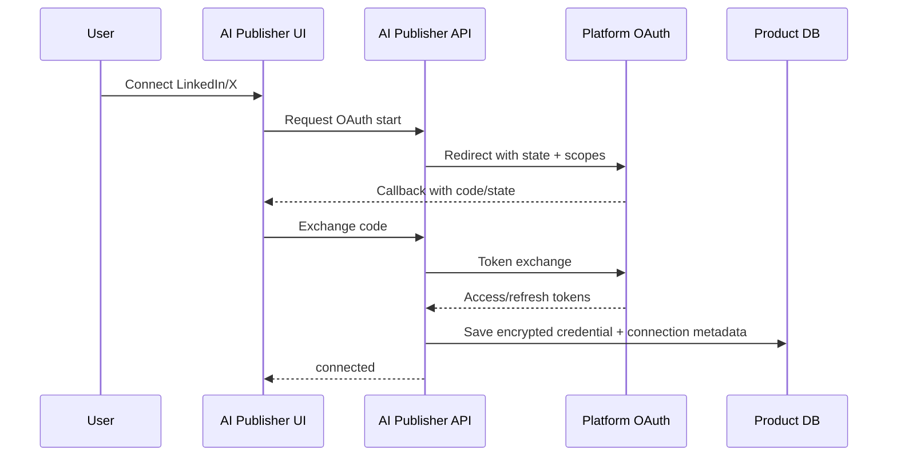
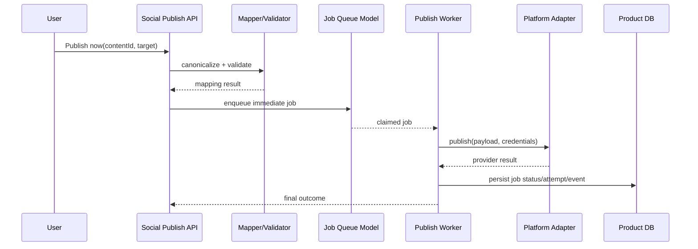
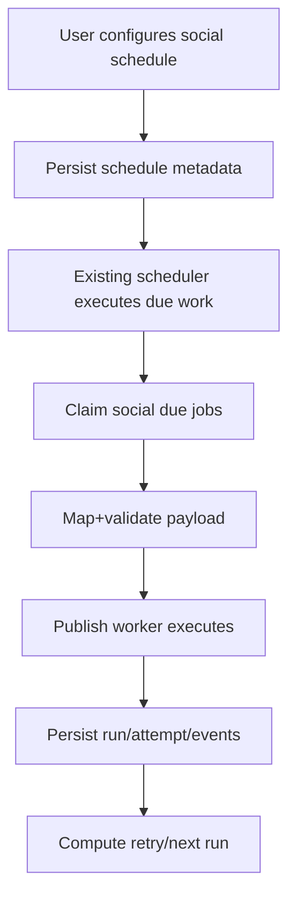
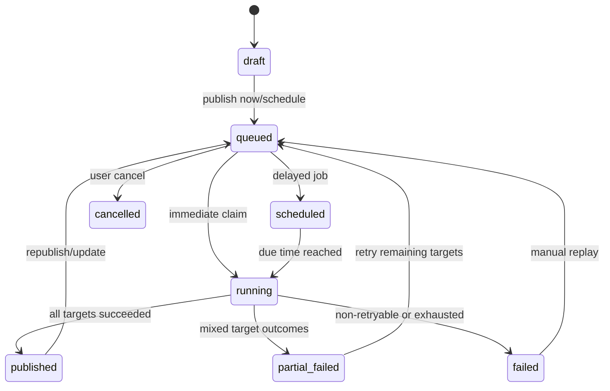

# Social Media Publishing Flows (ZLAP-STORY 7-1)

## A) Primary user flows

1. Connect social account
2. Create/select source content
3. Map content to platform payload
4. Publish now or schedule
5. Observe status and resolve failures

## B) Connect account flow (future implementation target)

## C) Publish-now flow

## D) Scheduled publish flow (reuse existing scheduler concepts)

## E) Status lifecycle model

## F) Retry and recovery flow

- Failure is classified into `retryable` or `non_retryable`.
- Retryable: transient network, provider 5xx, temporary rate limit.
- Non-retryable: revoked token, permission/scope mismatch, invalid payload/media policy rejection.
- Recovery options:
  - automatic retry with backoff+jitter (bounded)
  - reconnect account then replay failed jobs
  - edit payload then replay
  - cancel pending schedule

## G) Rate-limit/throttling flow

- Job dequeue checks budget at platform + account levels.
- If budget unavailable, transition attempt to `retry_scheduled` with throttle delay.
- Update local budget snapshot from provider headers when available.

## H) Audit and observability event flow

1. API emits structured request log.
2. Job transitions emit social event records.
3. Worker logs include request/job/attempt IDs for traceability.
4. Metrics include queue lag, success rate, retry exhaustion, auth failure rate.
